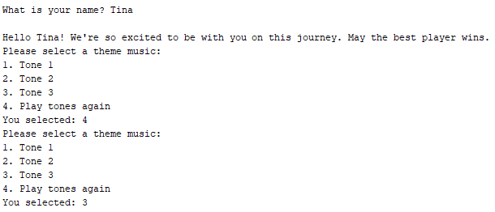

# Snakes and Ladders Game

Author: Tina Wu

Email: wu.tin@husky.neu.edu

## Abstract

This project intends to build an interactive Snake and Ladder game to inspire and encourage primary school students to become interested in STEM. This project utilizes concepts such as C programming basics, timer interrupts, and interacting with input and output devices connected to the DE1-SoC board.

## Introduction

The goal of this project is to build a game that is fun and educational for primary school students. This project hopes to inspire students to become interested and excited about STEM. In this project, we created an interactive snake and ladder game accompanied with sound effects using two speakers connected to the DE1-SoC board. This project utilizes concepts of C programming and hardware such as timer interrupts, loops, and processing user inputs.

## Software and Hardware used

Hardware:
- DE1-SoC Board
- Push Buttons
- JP1 Expansion Ports
- 2 Speakers

Software:
- Intel Monitor Program

## Project Steps

Part 1: Tone Generators Using Two Speakers
- Generate different tones using 2 speakers

Part 2: Snake Ladder Game
- Develop interactive Snakes and Ladders game
- Build a board with snakes and ladders sprinkled throughout the spaces

## Project Discussion

For this project, we decided to first begin working with the game play part instead of the speakers. We began by building a 10 by 10 board and added snakes and ladders among the spaces. We designated the space to be L for a ladder, S for a snake, O for the player, X for the computer, and $$ for the winning space 100. Next, we built the move functionality which receives the user’s destination as a parameter and moves the user to a specific space if the space is a ladder or a snake. Then, we wrote a simple implementation of rolling a dice by calculating a random value between 1 and 6. Lastly, we added output prompts to guide the user step by step through the game.

After completing the game play part, we began working generating tones on the 2 speakers. To begin this part, we first added the Interrupt Timers sample program to the project. We removed the unnecessary files and functions but kept the HPS timer and the interval timer. We used the HPS timer for 1 speaker and the interval timer for another speaker. Then, we built a music library that has different tones for the game to play as sound effects based on different scenarios.

## Results

**Beginning of game play:**

When the game starts, we first ask for the player’s name and then we display a welcome message for the player. Then, we ask the user to select a theme music. After each option is printed, the speakers will play the sound effect associated with the option. The user can choose to select one of the tones, or the user can choose to play all the tones again. After a user selects a valid tone, the game continues.

**Each round of game play:**

During each round of game play, the player goes first and then it’s the computer’s turn. During the player’s turn, the player will roll the dice by pushing 1 of the 4 push buttons on the DE1-SoC board. The game will print the result of the dice roll and the destination position after each turn. The game will also print the resulting board after each turn.

**Snakes and Ladders Game Board:**

The Snakes and Ladders game is driven by 2 players advancing throughout the board by rolling a dice. Each player could potentially land on a space that is either a snake or a ladder. In our game, one of the players is the computer. The red spaces are Snake spaces, labeled with S. The green spaces are Ladder spaces, labeled with L. The O space represents the player and the X space represents the computer. The $$ space is the winning space.

**Extra roll:**

In the Snakes and Ladders game, the player gets an extra roll if they roll a 6.

**Ladder:**

In the screenshot, the user’s previous position was 15, and then the user rolled a 6 which takes the user to position 21. Space 21 is a ladder that connects to space 42. So, when a user lands on 21, the game will automatically advance the user to 42. In addition, after every move that lands on a ladder, the speakers will play a special sound effect as indication.

**Snake:**

In the screenshot, the user’s previous position was 14, and then the user rolled a 2 which takes the user to position 16. Space 16 is a snake that connects to space 6. So, when a user lands on 16, the game will automatically retreat the user to 6. In addition, after every move that lands on a snake, the speakers will play a special sound effect as indication.

**Computer won:**

The computer’s previous position was 97, then the computer rolled a 3 which advances it to 100. When the compute reaches 100 before the user, the game displays a “You lost” text to the user.

**Player won:**

  
When the player reaches 100 before the computer, the game displays a “You won” text to the user.

## Analysis

For the analysis of this project, we will be analyzing different technical components as a part of building this project.

### Timer interrupts

To generate 2 tones on the 2 speakers, with each speaker potentially playing a different tone than the other, we needed 2 different timers. We originally wanted to use 2 HPS timers instead of using different types of timer for each speaker. However, we had trouble configuring the Generic Interrupt Controller for both HPS timer 0 and HPS timer 1. As a result, we decided to keep the interval timer included in the sample interrupt program and use the interval timer for 1 speaker and the HPS timer for the other speaker.

Each timer is configured with a counter value. That counter value determines the clock cycle of the timer and determines the frequency that generates a specific tone on the speakers. We decided to adjust the `config_HPS_timer()` and `config_interval_timer()` functions to take in an integer value to be set as the counter value. This change improves the design of the project because now the timers can be reconfigured at any point during the game to produce different tones without creating different timers for each tone.

Both timers have an interrupt service routine function: `HPS_timer_ISR()` and `interval_timer_ISR()`. Both interrupt service routines increment a tick variable and clears the interrupt’s timer. It is important for the timers to have its own tick variable because each timer may be on different clock cycles and we do not want one timer to over-write the tick variable for another timer. In both interrupt service routines, we extended the visibility of both tick variables using the keyword “extern” as these variables are also used in the main program. The interrupt service routine functions are called when there is an interrupt for the respective timer. This check is done by the IRQ exception handler function ` __cs3_isr_irq()` where it checks the interrupt ID against each of the timer’s interrupt IDs.

For any future timers or other types of interrupt signals, the programmer will need to provide a possible configuration function to initialize the signal, then the programmer will implement an interrupt service routine function to be called on every interrupt, lastly the programmer will add a conditional in the IRQ exception handler to call the interrupt service routine on the specific interrupt.

### Game board generation

For this project, we generated a static board, meaning every run of the game will result in the exact same board where the ladders and snakes are at the same positions as before. This is demonstrated in all the screenshots in the Results section. Some of the screenshots were not taken within the game, but all the boards are exactly the same. This is the result of hard-coding the exact destination position of every snake and ladder space. In the `nextMove()` function in move.c, we check the given original position and returns the destination position if the space is a snake or ladder, if not then the function just returns the same position.

The game board generation could potentially be randomized to make the board different every game. This would make some parts of the game more exciting for the user. However, for the resulting board to be fun, there are many conditions that needs to be satisfied such as: there should be ladders and snakes of varying length, there should be more snakes towards the end of the board and more ladders towards the beginning of the board, and there should be a minimum and maximum length for each snake and ladder. These conditions are much harder to satisfy if the board is truly randomized, we could potentially generate a board where all 6 of the spaces prior to the winning space are all snakes which would result in a never-ending game. Using a static board guarantees that all the snakes and ladders are strategically placed throughout the board. 

### Project design

We designed this game by separating the different functionalities into different files and helper functions to better organize and assign responsibilities. The main program simply calls the helper functions to advance the game from one step to the next. We split the project into the following categories and functionalities:
- art: display winning ASCII word art for the player or the computer
- board: print the board based on the player’s and the computer’s position
- timer interrupts: configurations for the timers, interrupt service routines, and exceptions
- main: dice roll, control logic of player and computer turns
- move: determine destination position on a snake or ladder space
- music: create theme tones and sound effects used in the game

The snake and ladder game has many possible sources of errors. There could be an off-by-one error with rolling the die where the resulted value ranges 0 to 5 instead of 1 to 6. There could be a sound effect error where instead of playing an ascending sound for the ladder, the game played a descending sound. Or, the resulting board after a turn does not display the player or the computer advancing through the board with its corresponding dice roll. Many more errors could happen during the implementation of this game. By organizing this project’s code into smaller identifiable categories, it is much easier to debug and investigate the source of the errors. If the game never produces a dice roll of 6, the error must be within the `rollDice()` function within the main file. If the displayed board is incorrect, then the error must be within the board file.

### User interaction

This game involves some user interaction. On game start, the user is asked to input their name so the game can display a welcome message addressing the user’s name. Then, the game immediately began displaying options for the user to select a theme music. The user has the option to replay the menu again and replay each theme music. After a user has selected a valid option to set the theme music of the game, the only user interaction for the rest of the game is during the dice roll.

We decided to incorporate the pushbuttons on the DE1-SoC board for the dice roll aspect of the game. Originally, we designed the game to perform a dice roll after a user enters an integer value in the terminal. However, as our intended audience is primary school students, we decided that a pushbutton is more interactive and more involved. In addition, after a dice is rolled and assuming the resulting value is n, the speakers will play a specific tone n times to imitate the player moving each space forward after rolling the dice.

### Additional future advancements

After the completion of this project, we realized that there is still a number of improvements and features that we could implement to make this game more fun, educational, and exciting for primary school students. We have decided that the following features, among possibly many others, will be a great addition to the already delightful game.

- Utilizing 7-segment displays
    - With 6 7-segment displays as a part of the DE1-SoC board, the game could display the user and the computer positions
    - The segments on one of the displays could randomly flash on and off to imitate a “loading” screen, before displaying the dice roll value
- Special bonus spaces
    - Randomly assigned bonus spaces where the player receives a “skip a snake”, block the other player’s turn, or extra roll card after landing on the bonus space
    - Randomly assigned bonus spaces where the player must solve an appropriate math arithmetic problem and receives a special card if the player answers correctly
- 2-player mode
    - Instead of a player playing against the computer, the player has the option to choose to play another player

## Conclusion

As a result of this project, we are now more familiar with C programming, timer interrupts, interfacing with hardware, and programming input and output devices including speakers.  We understand the organization, attention to detail, and technical dedication required to build an interactive game suitable for primary school students.
 
## References

[1] “DE1-SoC User Manual”, Terasic Technologies Inc., January 28, 2019.

[2] “DE1-SoC Computer System with ARM* Cortex* A9”, Intel Corporation – FPGA University Program, June 2017.

